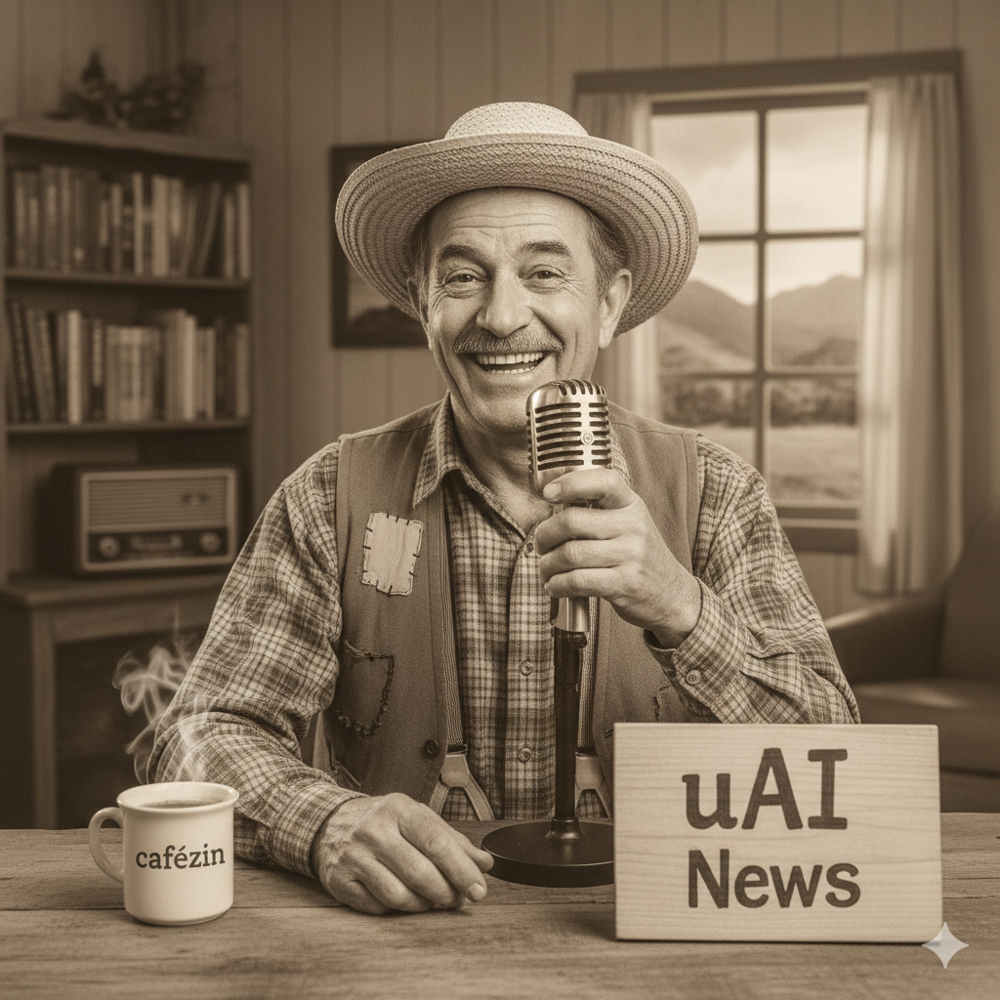

  

<h1 align="center">uAI News</h1>

  <a href="audio.mp3" title="Ouvir o Podcast">
    🎧 Clique para ouvir o Podcast Completo (audio.mp3)
  </a>

# Projeto Podcast Gerado por I.A.s

Projeto com o objetivo de **gerar um podcast** utilizando **ferramentas de IA** através de prompts mais trabalhados.

## 💻 Tecnologias Utilizadas

* **[Gemini](https://gemini.google.com/)**: Geração de roteiro e da imagem de capa (logo).
* **[Texto-para-voz gratuito](https://text-to-speech.online/)**: Geração do áudio inicial.
* **[Capcut](https://www.capcut.com/pt-br/)**: Edição final (tratamento de áudio e adição de sons de fundo).

## ✨ Como Foi Feito?

1.  **Roteiro** gerado via Gemini.
2.  **Áudio** gerado pelo "Texto-para-voz gratuito".
3.  **Logo/Imagem de capa** gerada pelo Gemini (via prompt).
4.  **Edição** feita no Capcut para tratar o áudio e adicionar sons de fundo.

## 🛠️ Instruções de Execução

Utilize os prompts contidos na pasta `src/prompts`.

* **🤖 Roteiro e Imagem:** Use os prompts de roteiro e de imagem no **`prompts.md`** 
* **🗣️ Áudio:** Copie o texto final do roteiro e cole na ferramenta **"Texto-para-voz gratuito"** para gerar o arquivo de áudio.
* **✂️ Edição:** Use o **Capcut** para juntar o áudio gerado e a música de fundo.
